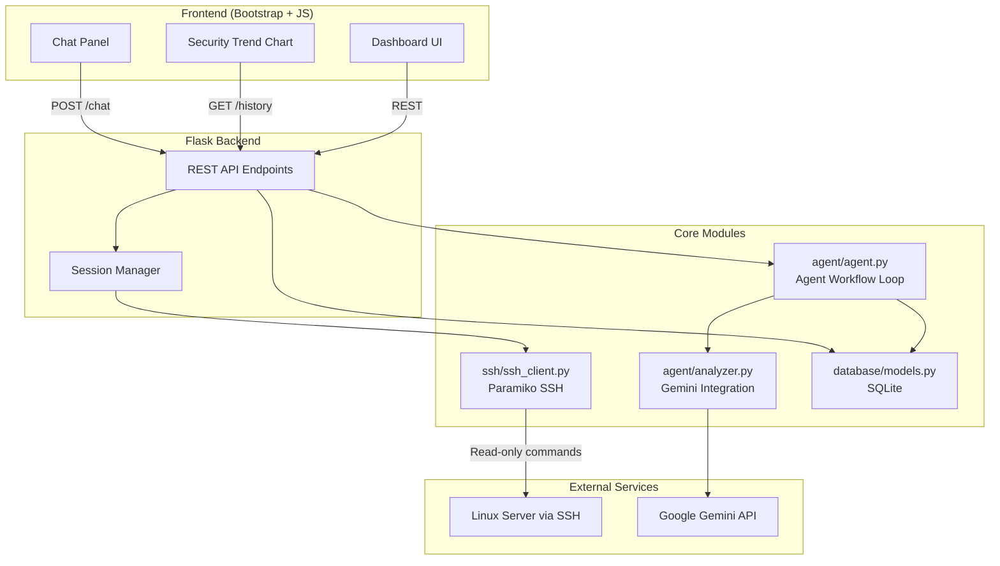
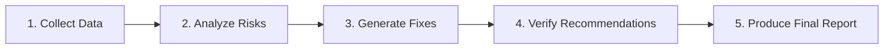

# AI-Powered Linux Hardening Assistant

A production-ready web application that connects to Linux servers via SSH, collects security configuration data, analyzes findings using Google Gemini AI, generates remediation scripts, and presents results in a modern Bootstrap dashboard.

## Features

- **SSH Connection** — Secure remote access via Paramiko with graceful error handling
- **Linux Security Audit** — Read-only command execution (SSH config, UFW, open ports, etc.)
- **AI Security Agent** — Multi-step Gemini-powered workflow with risk classification
- **Security Score** — Visual 0–100 score with color-coded ring
- **Remediation Scripts** — Auto-generated downloadable `fix.sh`
- **Audit History** — SQLite-backed history with trend graph
- **Bonus Features** — Dark mode, PDF export, chat with audit results, security trend chart

## Architecture



### Agent Workflow Loop



## Project Structure

```
linux-hardening-assistant/
├── app.py                  # Flask application & API routes
├── config.py               # Configuration from environment
├── requirements.txt        # Python dependencies
├── .env.example            # Environment variable template
│
├── demo/
│   └── demo_data.py        # Sample audit data for Demo Mode
│
├── agent/
│   ├── agent.py            # Agent workflow orchestrator
│   ├── analyzer.py         # Gemini API integration
│   └── prompts.py          # AI prompt templates
│
├── ssh/
│   └── ssh_client.py       # Paramiko SSH client & audit commands
│
├── database/
│   └── models.py           # SQLite audit history
│
├── templates/
│   └── index.html          # Bootstrap dashboard
│
├── static/
│   ├── css/style.css       # Light/dark theme styles
│   ├── js/app.js           # Frontend logic
│   └── assets/
│
├── reports/                # Generated fix scripts
└── README.md
```

## Setup Instructions

### Prerequisites

- Python 3.10+
- A Linux server accessible via SSH (for live audits)
- Google Gemini API key ([Get one here](https://aistudio.google.com/apikey))

### Installation

```bash
# Clone or navigate to the project
cd linux-hardening-assistant

# Create virtual environment
python -m venv venv

# Activate virtual environment
# Windows:
venv\Scripts\activate
# Linux/macOS:
source venv/bin/activate

# Install dependencies
pip install -r requirements.txt

# Configure environment
copy .env.example .env        # Windows
# cp .env.example .env        # Linux/macOS

# Edit .env and set your GEMINI_API_KEY
```

### Environment Variables

| Variable | Description | Default |
|----------|-------------|---------|
| `GEMINI_API_KEY` | Google Gemini API key | *(required)* |
| `GEMINI_MODEL` | Gemini model name | `gemini-2.0-flash` |
| `SECRET_KEY` | Flask session secret | `dev-change-me-in-production` |
| `FLASK_HOST` | Bind address | `0.0.0.0` |
| `FLASK_PORT` | Server port | `5000` |
| `SSH_TIMEOUT` | SSH connection timeout (seconds) | `15` |
| `SSH_COMMAND_TIMEOUT` | Command execution timeout | `30` |

### Run the Application

```bash
python app.py
```

Open your browser at **http://localhost:5000**

## Usage Workflow

1. **Quick start:** Click **Demo Mode** to explore the dashboard without SSH or an API key
2. Enter SSH credentials (host, username, password) and click **Connect**
3. Click **Run Audit** to collect security configuration data
4. Click **AI Analyze** to run the full agent workflow
5. Review findings by severity (High / Medium / Low)
6. Download `fix.sh` or export a PDF report
7. Use **Chat With Audit Results** to ask follow-up questions

### Demo Mode

Click **Demo Mode** in the Actions panel to instantly load:

- Sample Linux audit data (Ubuntu 22.04)
- Security score of **58/100**
- High, Medium, and Low risk findings with remediation commands
- Downloadable `fix.sh` and PDF export

No SSH server or Gemini API key is required for demo mode.

## API Documentation

### `POST /demo`

Load sample audit data and a pre-built security report. No SSH or Gemini required.

**Response (200):**
```json
{
  "success": true,
  "demo_mode": true,
  "audit": { "host": "192.168.1.50", "audit_results": { ... } },
  "report": {
    "security_score": 58,
    "findings": [...],
    "findings_by_severity": { "High": [], "Medium": [], "Low": [] },
    "fix_script": "#!/bin/bash\n..."
  }
}
```

---

### `POST /connect`

Establish SSH connection to a Linux server.

**Request Body:**
```json
{
  "host": "192.168.1.100",
  "username": "ubuntu",
  "password": "your-password"
}
```

**Response (200):**
```json
{
  "success": true,
  "connected": true,
  "host": "192.168.1.100",
  "username": "ubuntu",
  "message": "Successfully connected to 192.168.1.100"
}
```

**Errors:** `401` (auth), `503` (timeout/network)

---

### `POST /audit`

Run read-only security audit commands on the connected server.

**Prerequisite:** Active SSH connection via `/connect`

**Response (200):**
```json
{
  "success": true,
  "audit": {
    "host": "192.168.1.100",
    "server_info": { "os_name": "...", "kernel": "..." },
    "audit_results": { "permit_root_login": { "output": "..." } }
  }
}
```

---

### `POST /analyze`

Run the full AI agent workflow on collected audit data.

**Prerequisite:** Audit data from `/audit`

**Response (200):**
```json
{
  "success": true,
  "report": {
    "security_score": 65,
    "findings": [...],
    "findings_by_severity": { "High": [], "Medium": [], "Low": [] },
    "fix_script": "#!/bin/bash\n...",
    "workflow_steps": [...],
    "executive_summary": "..."
  }
}
```

---

### `GET /history`

Retrieve audit history and security score trend data.

**Query Parameters:** `limit` (default: 50, max: 100)

**Response (200):**
```json
{
  "success": true,
  "history": [...],
  "trend": [{ "date": "...", "server_ip": "...", "score": 65 }]
}
```

---

### `GET /download-fix-script`

Download the generated `fix.sh` remediation script.

**Prerequisite:** Completed analysis

**Response:** `application/x-sh` file download

---

### `GET /export-pdf` *(Bonus)*

Export the current audit report as a PDF.

---

### `POST /chat` *(Bonus)*

Chat with audit results using Gemini AI.

**Request Body:**
```json
{ "question": "Why is password authentication risky?" }
```

---

### `POST /disconnect`

Disconnect the active SSH session.

## Audit Commands

The following read-only commands are executed during an audit:

| Command | Purpose |
|---------|---------|
| `grep "^PermitRootLogin" /etc/ssh/sshd_config` | SSH root login setting |
| `grep "^PasswordAuthentication" /etc/ssh/sshd_config` | Password auth setting |
| `ufw status` | Firewall status |
| `ss -tuln` | Open/listening ports |
| `passwd -S root` | Root password status |
| `systemctl is-enabled ssh` | SSH service state |
| `cat /etc/os-release` | OS information |
| `uname -a` | Kernel information |

## Error Handling

| Error Type | HTTP Status | Description |
|------------|-------------|-------------|
| `auth_error` | 401 | Invalid SSH credentials |
| `timeout` | 503 | SSH connection timeout |
| `not_connected` | 400 | No active SSH session |
| `missing_audit_data` | 400 | Audit not run before analysis |
| `missing_api_key` | 500 | Gemini API key not configured |
| `api_failure` | 502 | Gemini API call failed |

## Security Considerations

- **Never commit** `.env` files or credentials to version control
- SSH passwords are held in server memory only during the session
- All audit commands are **read-only** — no system modifications during audit
- Review generated `fix.sh` scripts before executing on production systems
- Change the default `SECRET_KEY` in production deployments
- Use HTTPS in production environments

## License

MIT License — use freely for educational and commercial purposes.
